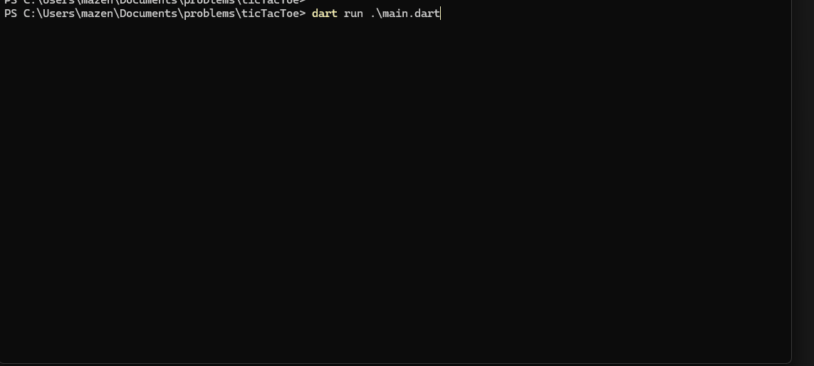

# Tic-Tac-Toe
It's a terminal ticTacToe game with 3 modes { 2 Players, Easy, Hard }
<br>
It's my first time to use algorithms i'm so excited to use more and more.

## Run Locally

Clone the game

```bash
  git clone https://github.com/MazenAhmed0/Tic-Tac-Toe
```
Go to the game directory

```bash
  cd Tic-Tac-Toe
```
To run the game, run the following command

```bash
  dart run main.dart
```

## Demo



## Author

- [@mazenahmed](https://www.github.com/MazenAhmed0)

[](https://www.linkedin.com/in/mazen-ahmed-974956249/)
[](https://x.com/MazenAhm3d)
